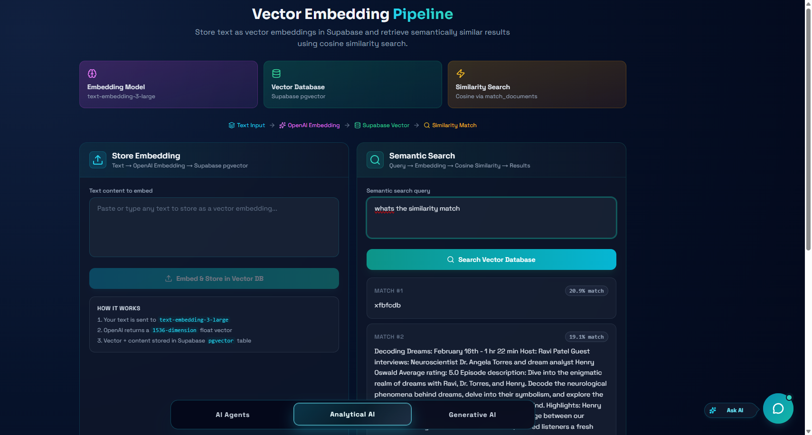

# AI Studio — Backend

The Node.js + TypeScript server that powers AI Studio. It connects the
frontend to **OpenAI**, **Azure OpenAI**, **Azure Voice Live**, **Supabase
pgvector**, **MongoDB**, and **SMTP email**, exposing simple HTTP and
WebSocket endpoints for three AI features.

**Live Demo**:
[tm-ai-studio.me](https://www.tm-ai-studio.me/) ·
[ai-studio.tarekmonowar.dev](https://ai-studio.tarekmonowar.dev/) ·
[ai-studio-tm.vercel.app](https://ai-studio-tm.vercel.app/)

**Repositories**:

- Frontend: [Ai-Studio-FrontEnd](https://github.com/tarekmonowar/Ai-Studio-FrontEnd)
- Backend: [Ai-Studio-BackEnd](https://github.com/tarekmonowar/Ai-Studio-BackEnd)

---

## What This Project Solves

This backend is the **brain and hands** of AI Studio. It does three big jobs:

1. Lets an AI agent **understand user intent** and run real server-side
   actions like sending emails or telling the frontend to navigate / restyle
   itself.
2. Turns text into **vector embeddings** and stores them in a vector database
   so the app can do semantic ("by meaning") search.
3. Streams **real-time voice conversations** between the user and an AI
   model, with proper turn detection and transcripts.

All requests are validated with Zod, all secrets stay on the server, and
every route is small, typed, and easy to follow.

---

## Feature 1 — Autonomous AI Agents


The agent module receives a chat history from the frontend, sends it to
**Azure OpenAI** with a list of strict, Zod-validated tool definitions, and
returns either a normal reply or a structured **tool call** the frontend can
execute.

Highlights:

- **GPT Function Calling** — the model picks the right tool (navigate,
  send email, update theme, change colors, etc.) and fills in the arguments.
- **Deterministic Fast Path** — obvious email requests are matched without
  even calling the model, which saves cost and time.
- **Email Tool** — `POST /ai/tools/send-email` sends real HTML emails using
  Nodemailer over SMTP, with sanitization and clean templates.
- **Stateless Design** — the server keeps no chat state; the frontend always
  sends the latest 12 messages, so scaling is simple.

---

## Feature 2 — Analytical AI (Vector Embeddings)



The Analytical AI module is a clean implementation of a **vector search
pipeline** using OpenAI embeddings and Supabase `pgvector`.

How it works:

1. **`POST /ai/vector/store`** — accepts plain text, calls
   `text-embedding-3-large` to produce a **1536-dimension** embedding, then
   inserts `{ content, embedding }` into the `vecto_embedding` table in
   Supabase.
2. **`POST /ai/vector/query`** — embeds the user's query the same way, then
   calls Supabase's `match_documents` RPC (cosine similarity) to return the
   top 3 closest documents along with a similarity score.

Why it matters:

- Powers **search by meaning** instead of exact keyword matching.
- Acts as the foundation for **RAG**, knowledge bases, smart FAQ bots, or
  any feature that needs to "understand" text.
- The pipeline is fully typed, with Zod-validated request bodies and clear
  error responses.

---

## Feature 3 — Generative AI Voice (Real-Time)

A WebSocket server connects the browser to **Azure Voice Live**, streaming
PCM16 audio in both directions for a natural spoken conversation. Built-in
features include:

- **Server-side VAD** with echo cancellation and Azure deep noise
  suppression.
- **Live transcripts** for both user and assistant turns.
- **Interview-prep mode** that picks unique questions across React,
  JavaScript, Node.js, Express, MongoDB, PostgreSQL, Docker, CSS, HTML, and
  more — and tracks which ones have already been asked.
- **English-learning mode** for spoken practice with feedback.
- **MongoDB conversation logs** + a per-IP rate limit using Mongoose.

---

## API Endpoints

| Method | Path                    | Purpose                                    |
| ------ | ----------------------- | ------------------------------------------ |
| GET    | `/health`               | Service health check                       |
| GET    | `/getLogs`              | Read recent server logs                    |
| POST   | `/ai/agent-chat`        | AI Agents (function calling)               |
| POST   | `/ai/messenger-chat`    | Floating AI messenger chat                 |
| POST   | `/ai/vector/store`      | Embed text and save to Supabase pgvector   |
| POST   | `/ai/vector/query`      | Semantic similarity search                 |
| POST   | `/ai/tools/send-email`  | Send a real email via SMTP                 |
| WS     | `/ws`                   | Real-time voice session (Azure Voice Live) |

---

## Tech Stack

- **Runtime**: Node.js (native `http` + `ws`, no Express needed)
- **Language**: TypeScript (ESM)
- **AI Models**: Azure OpenAI (GPT) + OpenAI Embeddings + Azure Voice Live
- **Vector DB**: Supabase `pgvector` (`text-embedding-3-large`, 1536 dims)
- **Database**: MongoDB via Mongoose (sessions + conversation logs)
- **Email**: Nodemailer over SMTP
- **Validation**: Zod
- **Dev tooling**: tsx (watch mode), TypeScript

---

## Getting Started

1. **Clone the repository**

   ```bash
   git clone https://github.com/tarekmonowar/Ai-Studio-BackEnd.git
   cd backend
   ```

2. **Install dependencies**

   ```bash
   npm install
   ```

3. **Set up environment variables** — create a `.env` file (see `.env.example`):

   ```env
   PORT=8787
   CORS_ORIGIN=http://localhost:3000

   # Azure Voice Live (real-time voice)
   VOICELIVE_ENDPOINT=https://YOUR_RESOURCE.services.ai.azure.com/api/voicelive
   VOICELIVE_API_KEY=YOUR_AZURE_API_KEY
   VOICELIVE_MODEL=gpt-realtime

   # Azure OpenAI (AI Agents + Embeddings)
   AZURE_OPENAI_ENDPOINT=https://YOUR_RESOURCE.openai.azure.com/openai/v1
   AZURE_OPENAI_API_KEY=YOUR_AZURE_OPENAI_API_KEY
   AZURE_OPENAI_MODEL=gpt-4.1-mini
   AZURE_OPENAI_API_VERSION=2024-10-21

   # Embedding model for Analytical AI
   AI_EMBEDDING_MODEL=text-embedding-3-large

   # Supabase (vector database)
   SUPABASE_URL=https://YOUR_PROJECT.supabase.co
   SUPABASE_API_KEY=YOUR_SUPABASE_SERVICE_KEY

   # MongoDB (conversation logs + rate limit)
   MONGODB_URI=YOUR_MONGODB_ATLAS_CONNECTION_STRING
   RATE_LIMIT_ENABLED=true
   RATE_LIMIT_MINUTES=15

   # SMTP for the email tool
   EMAIL_USER=your_smtp_email@gmail.com
   EMAIL_PASS=your_smtp_password
   EMAIL_FROM=your_smtp_email@gmail.com
   ```

4. **Run the development server**

   ```bash
   npm run dev
   ```

   The server will start on `http://localhost:8787`.

5. **Build and run in production**

   ```bash
   npm run build
   npm start
   ```

---

## Project Structure (high level)

```
src/
├── server.ts                            → HTTP + WebSocket bootstrap
├── app.ts                               → Request routing & CORS
└── app/
    ├── routes/index.ts                  → All route definitions
    ├── config/env.ts                    → Zod-validated env schema
    └── modules/
        ├── AiAgents/                    → Function calling, tools, prompts
        ├── analyticalAi/                → Embedding store + semantic search
        ├── generativeAi/                → Real-time voice (Azure Voice Live)
        ├── aiMessenger/                 → Floating chat messenger backend
        ├── tools/                       → Email tool (Nodemailer)
        ├── health/ · logs/              → Health and log endpoints
```

---

## Supabase Setup (for Analytical AI)

In your Supabase project, enable the `vector` extension and create a table
plus an RPC for similarity search:

```sql
create extension if not exists vector;

create table vecto_embedding (
  id bigserial primary key,
  content text not null,
  embedding vector(1536) not null
);

create or replace function match_documents (
  query_embedding vector(1536),
  match_threshold float,
  match_count int
)
returns table (content text, similarity float)
language sql stable
as $$
  select content,
         1 - (embedding <=> query_embedding) as similarity
  from vecto_embedding
  where 1 - (embedding <=> query_embedding) > match_threshold
  order by embedding <=> query_embedding
  limit match_count;
$$;
```

---

_For the user interface that consumes this API, see the
[Frontend Repository](https://github.com/tarekmonowar/Ai-Studio-FrontEnd)._
