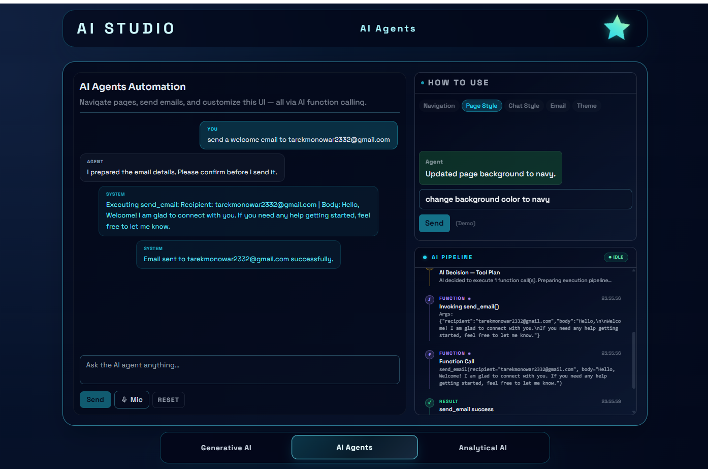
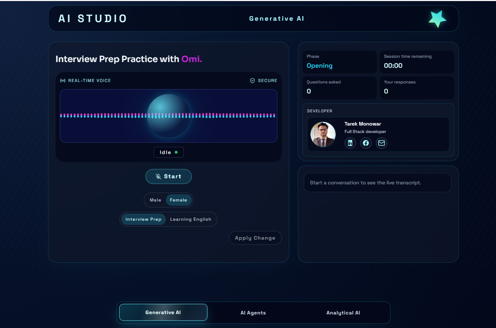

# 🎙️ AI Studio - Backend Voice Gateway

**Live Demo**:
[https://ai-studio.tarekmonowar.dev/](https://ai-studio.tarekmonowar.dev/) |
[https://ai-studio-tm.vercel.app/](https://ai-studio-tm.vercel.app/)

**GitHub Repositories**:

- Frontend:
  [https://github.com/tarekmonowar/Ai-Studio-FrontEnd](https://github.com/tarekmonowar/Ai-Studio-FrontEnd)
- Backend:
  [https://github.com/tarekmonowar/Ai-Studio-BackEnd](https://github.com/tarekmonowar/Ai-Studio-BackEnd)



## 📖 What This Project Solves

AI Studio Backend acts as the real-time gateway and intelligence hub for an
interactive voice assistant geared towards technical mock interviews. It bridges
the gap between the user's audio input via WebSockets and Azure's VoiceLive AI
services. It is responsible for session lifecycle, topic-specific interview
questions generation (React, Node, Next.js, Docker, etc.), and securely managing
AI provider credentials — delivering a near-zero latency, robust AI interaction.

## ✨ Features

- **Low-Latency Audio Relay**: Custom WebSocket middleware (`wsAsyncHandler.ts`)
  processes bidirectional audio streams securely.
- **Dynamic Interview Engine**: Serves categorized technical questions across a
  dozen topics (JavaScript, TypeScript, PostgreSQL, MongoDB, Next.js, etc.).
- **Session & Transcript Management**: Persists generated conversation logs
  securely into MongoDB for review.
- **Provider Abstraction**: Interacts securely with Azure VoiceLive SDK to
  execute cutting-edge generative voice AI.

## 🛠️ Tech Stack

- **Runtime**: Node.js & TypeScript
- **Database**: MongoDB (Mongoose)
- **WebSockets**: `ws`
- **Validation**: Zod
- **AI Integrations**: Azure VoiceLive SDK

## 🚀 Getting Started

1. **Clone the repository**:

   ```bash
   git clone https://github.com/tarekmonowar/Ai-Studio-BackEnd.git
   cd backend
   ```

2. **Install Dependencies**:

   ```bash
   npm install
   ```

3. **Set up Environment Variables**: Create a `.env` file based on your
   configuration needs:

   ```env
   PORT=8787
   VOICELIVE_ENDPOINT=your-azure-voicelive-endpoint
   VOICELIVE_API_KEY=your-azure-voicelive-api-key
   MONGODB_URI=your-mongodb-connection-string
   ```

4. **Run the Development Server**:
   ```bash
   npm run dev
   ```

### Endpoints

- **Health Check**: `GET /health`
- **Voice WebSocket**: `WS /ws`

---

_For the user interface and client experience, check out the
[Frontend Repository](https://github.com/tarekmonowar/Ai-Studio-FrontEnd)._

## 🧠 Generative AI Capabilities



The backend system dynamically supports comprehensive **Generative AI** capabilities. It acts as a highly secure, heavily optimized API proxy to advanced language models, coordinating active prompt state, managing context limits, and reliably streaming complex text completion insights back to the user application concurrently with the voice gateway.
